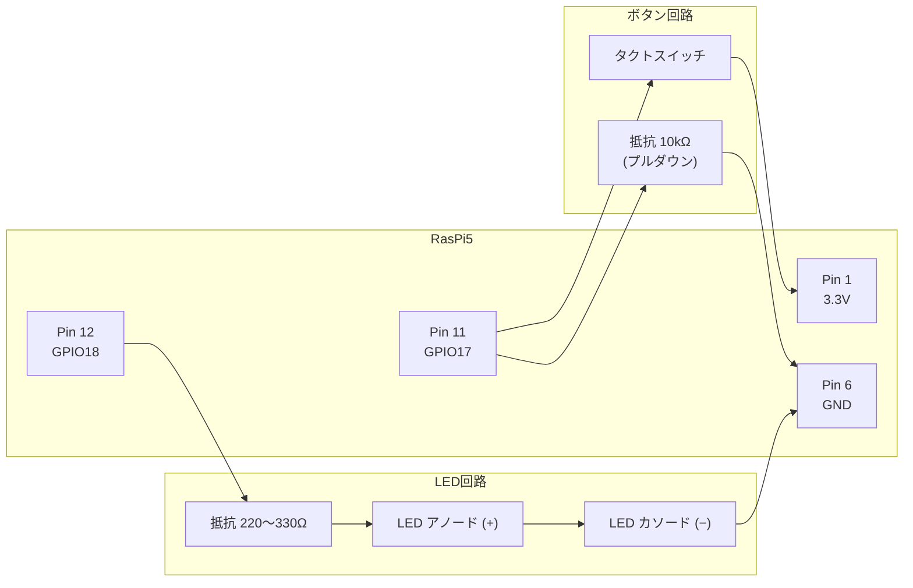
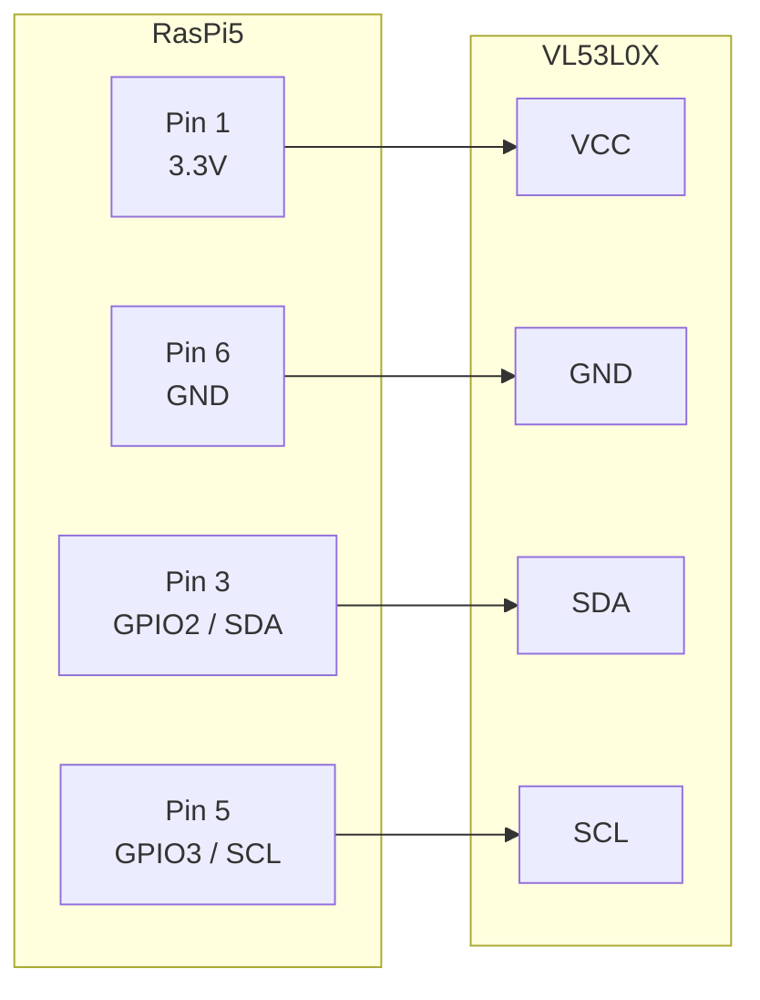
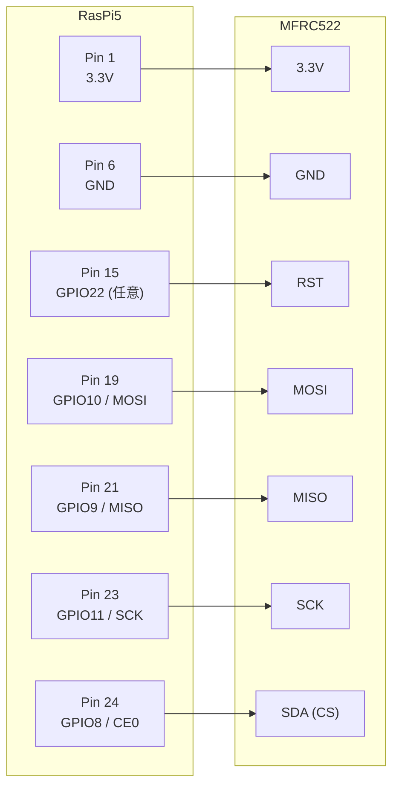

# ハードウェア配線

実機（Raspberry Pi 5）でデモを動かすための配線。

---

## 必要なもの

| 物 | 用途 |
|---|---|
| ブレッドボード | 配線の土台 |
| ジャンパーワイヤー（オス-メス） | RasPi GPIO ↔ ブレッドボード |
| ジャンパーワイヤー（オス-オス） | ブレッドボード内 |
| LED | 点灯確認 |
| 抵抗 220〜330Ω | LED の電流制限（220Ω なら明るめ、330Ω なら標準） |
| 抵抗 10kΩ | ボタンのプルダウン |
| タクトスイッチ | ボタン |

電子工作スターターキットを買うのが一番楽。

---

## LED + ボタン デモの配線

`gpio_led_button` を実機で動かすための配線。

- **LED 回路**: GPIO18 → 抵抗 → LED → GND（電流制限のために抵抗が必要）
- **ボタン回路**: 押すと GPIO17 が 3.3V に繋がる。押していない時は 10kΩ 抵抗で GND に落として 0V を維持（プルダウン）

---

## VL53L0X（I2C 距離センサー）の配線

I2C はデフォルト無効。`sudo raspi-config nonint do_i2c 0 && sudo reboot` で有効化。

---

## MFRC-522（SPI RFID リーダー）の配線

SPI も `sudo raspi-config nonint do_spi 0 && sudo reboot` で有効化。

---

## LCD HAT（240x240 ST7789）

「HAT」型のモジュールは RasPi5 の 40 ピン GPIO ヘッダに直接かぶせる。ブレッドボード不要。

---

## ピン配置の参考

- [pinout.xyz](https://pinout.xyz/) — インタラクティブなピン配置図
- [Raspberry Pi 公式ドキュメント](https://www.raspberrypi.com/documentation/computers/raspberry-pi.html#gpio)
